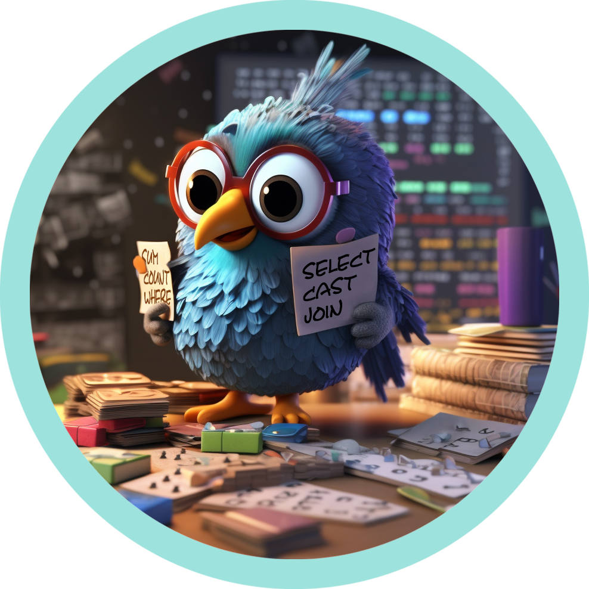
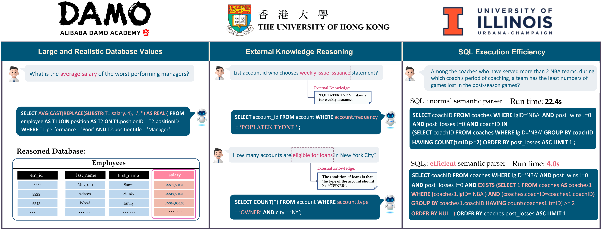

# BIRD-SQL: A BIg Bench for Large-Scale Relational Database Grounded Text-to-SQLs

<p align="center">
  
</p>

<p align="center" width="100%">
  <a href="https://arxiv.org/abs/2305.03111">🔗Paper</a>
  <a href="https://bird-bench.github.io/">🏆Leaderboard</a>
<p>


[](https://creativecommons.org/licenses/by-sa/4.0/deed.en)
[](https://bird-bench.github.io/)
[](https://www.python.org/downloads/release/python-390/)
[](https://pytorch.org/blog/pytorch-1.8-released/)
[](https://bird-bench.github.io/)
[](https://www.python.org/downloads/release/python-390/)

**License Notation**: Due to large volume of requests, now we change the license to <code>CC BY-SA 4.0</code>.

<p align="center" width="100%">
<a></a>
</p>

## Overview

BIRD-SQL is the first cross-domain large-scale benchmark specifically designed to bridge the gap between academic research and real-world applications in the field of text-to-SQL parsing. While models such as Codex and ChatGPT have demonstrated remarkable performance, existing benchmarks such as Spider and WikiSQL concentrate primarily on database schema, leaving database contents largely unexplored. Realizing this limitation, we set out to create a comprehensive benchmark that delves deeper into database values, ultimately unveiling new challenges and opportunities for developments in the text-to-SQL domain.

BIRD-SQL is distinguished by its large dataset, which includes **12,751** text-to-SQL pairs, **95** databases encompassing **37** professional domains, and a total size of **33.4 GB**. By highlighting database values, BIRD-SQL draws attention to new challenges, such as external knowledge, dirty data, and SQL efficiency in vast databases. In order to generate accurate SQL queries, models must not only conduct semantic parsing but also comprehend database values.

## Dataset Introduction

The dataset contains the main following resources:

- `database`: The database should be stored under the [`./data/dev_databases/`](./data/dev_databases/). In each database folder, it has two components:
  - `database_description`: the csv files are manufactured to describe database schema and its values for models to explore or references.
  - `sqlite`: The database contents in BIRD.
- `data`: Each text-to-SQL pairs with the oracle knowledge evidence is stored as a json file, i.e., `dev.json` is stored on [`./data/dev.json`](./data/dev.json). In each json file, it has three main parts:
  - `db_id`: the names of databases
  - `question`: the questions curated by human crowdsourcing according to database descriptions, database contents.
  - `evidence`: the external knowledge evidence annotated by experts for assistance of models or SQL annotators.
  - `SQL`: SQLs annotated by crowdsource referring to database descriptions, database contents, to answer the questions accurately.
- `ground-truth SQL file`: The SQL file should be stored at [`./llm/data/dev_gold.sql`](./llm/data/dev_gold.sql).
- `llm`: It contains source codes to convert texts to SQLs by calling APIs from LLMs (currently set up for GPT-5.2 via the AI/ML API gateway), plus [`./llm/error_analysis/`](./llm/error_analysis/), a structured pipeline for generating, evaluating, and doing clause-level error analysis on full dev-set runs.

## In-Context Learning (ICL):

### Environment Setup:

```bash
cd ./llm/
uv venv .venv --python 3.11
uv pip install --python .venv -r requirements.txt
```

Put your model API key in `./llm/run/.env` or `./llm/run/.env.local` (`AIMLAPI_API_KEY=...`); these files are gitignored.

### Collect results

Then you could directly execute the command line by following instructions (you may need to adjust paramters and paths with your preference):

```bash
cd ./llm/
sh ./run/run_gpt.sh
```

### Structured error analysis

[`./llm/error_analysis/`](./llm/error_analysis/) runs the same generate → evaluate steps over the full dev set and adds clause-level structural diffing (predicted vs. gold SQL) plus an HTML report. See [`./llm/error_analysis/METHODOLOGY.md`](./llm/error_analysis/METHODOLOGY.md). Needs its own `./llm/error_analysis/.env` (`OPENAI_API_KEY` + `OPENAI_BASE_URL` pointed at the AI/ML API gateway) — see `.env.example` in that folder.

```bash
cd ./llm/
.venv/bin/python error_analysis/01_generate.py   # --limit N for a smoke test
.venv/bin/python error_analysis/02_evaluate.py
.venv/bin/python error_analysis/03_analyze_wrong.py
.venv/bin/python error_analysis/04_analyze_gold.py
.venv/bin/python error_analysis/05_compare_report.py
.venv/bin/python error_analysis/06_pairwise.py
.venv/bin/python error_analysis/build_report.py  # -> error_analysis/report.html
```

## Evaluation:

### Execution (EX) Evaluation:

Please post-process your collected results as the format: SQL and its `db_id`, which is splitted by `'\t----- bird -----\t'` (see `predict_dev.json` written by [`./llm/run/run_gpt.sh`](./llm/run/run_gpt.sh) for a live example). Put the ground-truth sql file in the [`./data/`](./data/). And you may need to design a ChatGPT tag by your own.
The main file for ex evaluation is located at [`./llm/src/evaluation.py`](./llm/src/evaluation.py). \
Then you could evaluate the results by the following command line :

```bash
cd ./llm/
sh ./run/run_evaluation.sh
```

### Valid Efficiency Score (VES) Evaluation (time-mainly):

In the newest version, ves and ex can be evaluated in the same shell. Then main file is [`./llm/src/evaluation_ves.py`](./llm/src/evaluation_ves.py), so you can eval your efficiency via:

```bash
cd ./llm/
sh ./run/run_evaluation.sh
```
(For stable VES, you may need to enlarge `timeout` or repeat and average results. In our test evaluation, we will enlarge `timeout` to 3 s/ex; then we repeat 5 times for VES computation, only the highest results will be reported.)

## Test Evaluation

If your code scripts don't need complex environment setting up and can fetch results via openai-api mainly. Please connect bird.bench23@gmail.com for fast test. 

## Acknowledgement

We thank Xin Yan for active involvement in ChatGPT prompt design, discussion, and figure creation in the HKU STAR Lab. We thank Jan Motl, Oliver Schulte for valuable suggestions and assistance in maintaining the databases from [`https://relational.fit.cvut.cz/`](https://relational.fit.cvut.cz/).

## Call for Calibration

In this work, we are committed to delivering high-quality datasets to boost the development of text-to-SQL research. Despite our hard efforts in evaluating and refining this benchmark with ~700 hours, we acknowledge that errors and ambiguities may still exist. To ensure long-term contributions to the text-to-SQLs, we are actively soliciting community feedback on possible enhancements to our datasets. Please consider reporting errors or your suggestions on the [`ISSUES`](https://github.com/AlibabaResearch/DAMO-ConvAI/issues/39), or via emailing us by bird.bench23@gmail.com.

We will also polish this benchmark periodically. Therefore, We would be grateful if you could provide any feedback regarding errors or future directions to BIRD. Let's contribute to the future of text-to-SQL research. Thank you for your support!

## Insteresting Stories about Values:
we are welcome to any findings during experiments about interaction with database values. For example, we find that GPT4-32k even fails to consider the tied results in a joined tables correctly. \
In the `dev_1388`, the predicted SQL of GPT4-32k is:
```
Question: Which students manage to generate the highest income. State his/her name along with the income source.
```
```sql
SELECT T1.first_name, T1.last_name, T2.source  
FROM member AS T1  
INNER JOIN income AS T2 ON T1.member_id = T2.link_to_member  
WHERE T2.amount = (  
    SELECT MAX(amount)  
    FROM income  
)  
ORDER BY T2.amount DESC
```
it leads to a NULL result set since `MAX(amount)` is `3000` in the orignal table income. However, the ground-truth SQL should consider the `MAX(amount)` in the joined table pertaining to tables `member` and `income`. Therefore, the largest amount is only `50`, and the ground-truth SQL should be:
```sql
SELECT T1.first_name, T1.last_name, T2.source
FROM member AS T1
INNER JOIN income AS T2
ON T1.member_id = T2.link_to_member
WHERE T2.amount = (
    SELECT MAX(T4.amount)
    FROM member AS T3
    INNER JOIN income AS T4
    ON T3.member_id = T4.link_to_member
    )
```
We hypothesize that GPT-4 is pre-trained based on semantic parsing framework, losing the enough attention on values. This may also be marked as the initial challenge in achieving Artificial General Intelligence (AGI) for real-world text-to-SQL applications.

## Citation

Please cite the repo if you think our work is helpful to you.

```
@misc{li2023llm,
  title={Can LLM Already Serve as A Database Interface? A BIg Bench for Large-Scale Database Grounded Text-to-SQLs},
  author={Jinyang Li and Binyuan Hui and Ge Qu and Binhua Li and Jiaxi Yang and Bowen Li and Bailin Wang and Bowen Qin and Ruiying Geng and Nan Huo and Xuanhe Zhou and Chenhao Ma and Guoliang Li and Kevin C. C. Chang and Fei Huang and Reynold Cheng and Yongbin Li},
  year={2023},
  eprint={2305.03111},
  archivePrefix={arXiv},
  primaryClass={cs.CL}
}
```
